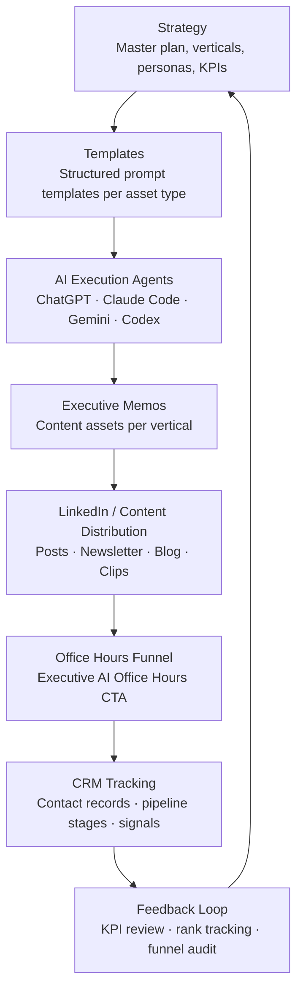

# System Architecture
## Houston AI Authority Engine

This document explains how the authority engine works — stage by stage — from strategic input to CRM-tracked business output.

---

## Pipeline Diagram



---

## Stage-by-Stage Explanation

### 1. Strategy
**Files:** `docs/MASTER_AUTHORITY_SYSTEM_PLAN.md`, `SYSTEM_CONTEXT.md`

The system begins with a defined authority strategy. This includes:
- Target verticals (Energy, Healthcare, Professional Services)
- Target personas (C-suite, VP, board-level executives)
- Content angles and positioning per vertical
- KPIs and success signals (rank movement, discovery calls, retainers)

Strategy is the cognitive backbone of the system. All downstream output is constrained by decisions made here.

---

### 2. Templates
**Files:** `/templates/`

Each content asset type has a reusable structured template. Templates define:
- Audience
- Format and length
- Required sections (Opening Position, Reality, Recommendations, CTA)
- Tone and voice constraints

Templates enforce deterministic output. The same template fed to any AI agent produces a consistent, professional asset. This prevents drift, reduces editing, and enables repeatable execution.

**Available templates:**
- `executive-memo.md` — Short, opinionated vertical-specific memos
- `case-study.md` — Board-ready proof assets
- `event-recap.md` — Post-event content capture
- `weekly-brief.md` — Recurring intelligence brief
- `pipeline-entry.md` — CRM-ready prospect record
- `content-atomization.md` — Pillar-to-derivative breakdown

---

### 3. AI Execution Agents
**Files:** `docs/AGENT_ARCHITECTURE.md`

Multiple AI models operate with defined cognitive boundaries. No agent duplicates another's role.

| Agent | Role | Strength |
|---|---|---|
| ChatGPT | Strategic Architect | Authority modeling, system design, KPI reasoning |
| Claude Code | Structured Builder | Markdown execution, template enforcement, formatting |
| Codex | Logic Engineer | Pipeline design, system logic, clean refactors |
| Gemini (OpenClaw) | Long-Context Synthesizer | Cross-document synthesis, pattern recognition at scale |
| NanoClaw *(future)* | Recurring Micro Agents | Weekly briefs, SEO reviews, recurring tasks |
| ZeroClaw *(future)* | Orchestration Controller | Routes tasks to agents; never writes content |

**Domain Separation Principle:**
- Strategic decisions → ChatGPT
- Structured execution → Claude Code
- Logic and refinement → Codex
- Mass context synthesis → Gemini
- Recurring automation → NanoClaw
- Task routing → ZeroClaw

---

### 4. Executive Memos
**Files:** `/content/executive-memos/`

The primary Phase 2 output type. Each memo is:
- ~800 words
- Targeted at C-suite and VP-level executives
- Vertical-specific (Energy, Healthcare, Professional Services)
- Structured: Opening Position → Reality → Recommendations → Implications → CTA

**Published assets:**

| Memo | Vertical |
|---|---|
| `houston-energy-ai-operating-model.md` | Energy |
| `houston-healthcare-ai-governance.md` | Healthcare |
| `houston-professional-services-ai-operating-model.md` | Professional Services |

---

### 5. LinkedIn / Content Distribution
**Files:** `docs/INTERNAL_LINKING_MODEL.md`, `templates/content-atomization.md`

Each authority asset is atomized into multiple distribution formats:

```
Executive Memo
  → 3 LinkedIn posts
  → 1 blog post
  → Newsletter section
  → Short-form clips
  → Event talking point
```

The content atomization rule: no high-effort asset is published once.

---

### 6. Office Hours Funnel
**Files:** `docs/EXEC_OFFICE_HOURS_SYSTEM.md`, `docs/FUNNEL_ARCHITECTURE.md`

Each published asset drives traffic to the Executive AI Office Hours — a structured, limited-seat working session for senior executives.

Funnel stages:
1. Content discovery (LinkedIn, SEO, referral)
2. CTA click → Office Hours registration
3. Pre-session qualification
4. Paid Readiness Sprint offer
5. Enterprise retainer pipeline

---

### 7. CRM Tracking
**Files:** `docs/CRM_SYSTEM_BLUEPRINT.md`, `docs/PIPELINE_TRACKING_SYSTEM.md`

Engagement signals are captured and mapped to pipeline records. Each contact is tracked across:
- Source (which content drove awareness)
- Stage (awareness → engaged → qualified → opportunity → client)
- Vertical and company size
- Last touchpoint and next action

The CRM system converts authority signals into actionable pipeline data.

---

### 8. Feedback Loop
**Files:** `docs/SEO_AND_AUTHORITY_TRACKING.md`, `SYSTEM_CONTEXT.md`, `TASKS.md`

Pipeline data, rank movement, and engagement signals feed back into strategy. The feedback loop includes:
- Monthly KPI review (rank positions, discovery calls, retainers)
- Funnel conversion analysis
- Content performance by vertical
- Agent output quality review

Insights from the feedback loop inform the next cycle of strategy and content production.

---

## Key Design Principles

**Constraint produces quality.** Every stage of the pipeline is constrained by a template, a role definition, or a governance rule. AI output quality comes from structure, not from free generation.

**Separation of concerns.** Each agent has one cognitive domain. Each template has one output type. Each stage of the pipeline has one job. Overlap creates chaos.

**Repeatability over novelty.** The system is designed to produce the same quality of output on the tenth execution as it does on the first. Infrastructure, not inspiration.

**Houston as the anchor.** All content is grounded in the Houston market — its industries, its executives, its specific challenges. National amplification follows local authority.
